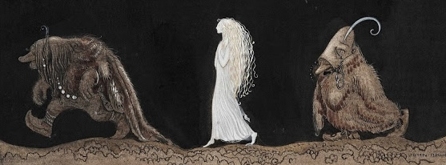

 
 

<h1 align="center"> Pensamiento Crítico </h1>

---

		

---

### 06-02
#### Presentación de la asignatura; Diagnóstico

1. Grupo de WhatsApp y LMS
2. Diagnóstico (primera parte)
3. Presentación de la página oficial
4. Plan Global Mínimo
5. Cronograma de la UA1
6. Glosarios, guías y listas de cotejo
7. Recurso didáctico: pizarras grupales
8. Sobre el propósito de la asignatura
9. Diagnóstico (segunda parte)

---

#### Segunda parte

*Marco Aurelio Denegri (1938-2018)* 

Ching Hai, la maestra taiwanesa que alcanzó la iluminación, según dicen, en el Himalaya y a quien se considera Buda viviente, está alborotando el cotarro espiritual, tanto en Oriente cuanto en Occidente, desde hace alrededor de un tricenio.

Su método, esencialmente búdico, exige, entre otras cosas, dieta vegetariana y ánimo enteramente positivo. Intimaciones o requerimientos fundamentales son además la meditación, la contemplación, la reflexión y la querencia vehemente y desesperada de un gran cambio existencial, vale decir, la transformación espiritual o la iluminación.

Ching Hai ejemplifica esto último refiriendo una historia muy interesante del budismo zen. Es una historia zénica muy vívida; quiero decir, verdaderamente eficaz en cuanto el mensaje. Consta en la página 36 del número 94 de la revista *The Supreme Master Ching Hai News*.

La historia zénica es como sigue:

Un discípulo del zen pregunta a su maestro cómo puede alcanzar la iluminación y su maestro le responde que deseándolo muchísimo; entonces el discípulo le pregunta qué es muchísimo.

"Ah –le dice el maestro–, ven conmigo, acompáñame al río."

Llegan al río y el maestro le indica al discípulo que meta completamente la cabeza debajo del agua, que la hunda bien en ella y que aguante la respiración. El discípulo le obedece, pero al cabo de medio minuto, necesitando respirar, quiere sacar la cabeza, pero el maestro inmediatamente se la vuelve a hundir. Entonces se inicia un forcejeo de intensidad creciente entre el discípulo que quiere sacar la cabeza y el maestro que no quiere que la saque. El discípulo traga agua, se desespera, patalea, comienza a sufrir de asfixia por sumersión, y cuando ya está ahogándose, el maestro lo levanta y lo saca fuera del agua. El discípulo, desfalleciente, extenuado, jadeante, llega a decir a su maestro, con voz entrecortada: 

"Maestro, ¿por qué me ha hecho esto? Casi me ahogo, casi me muero.

"El maestro le dijo:

"Lo hice porque quería que te desesperaras. Ahora entenderás que sólo queriendo desesperadamente la iluminación la alcanzarás. Si no la buscas con desesperación, entonces jamás te iluminarás."

Para la inmensa mayoría de la humanidad, el designio del gran cambio, propulsado por la desesperación y la vehemencia, es algo tan escasamente atractivo como pellizcar vidrio o contar los granos de arena de un arenal.

Gurdjieff decía (y su dicho tiene la patencia de un axioma) que en nuestra vida hacemos los mayores esfuerzos para no hacer ningún esfuerzo.

---

**Responde a las siguientes preguntas** 
1. Propón una pregunta en la que se sintetice las intenciones del texto.
2. ¿Qué respuesta ha dado el autor a la pregunta?
3. ¿Cómo o qué medios usa el autor para sustentar la afirmación central del texto?
4. ¿Estás de acuerdo el texto? Si sí, ¿por qué? Si no, ¿por qué?

 

