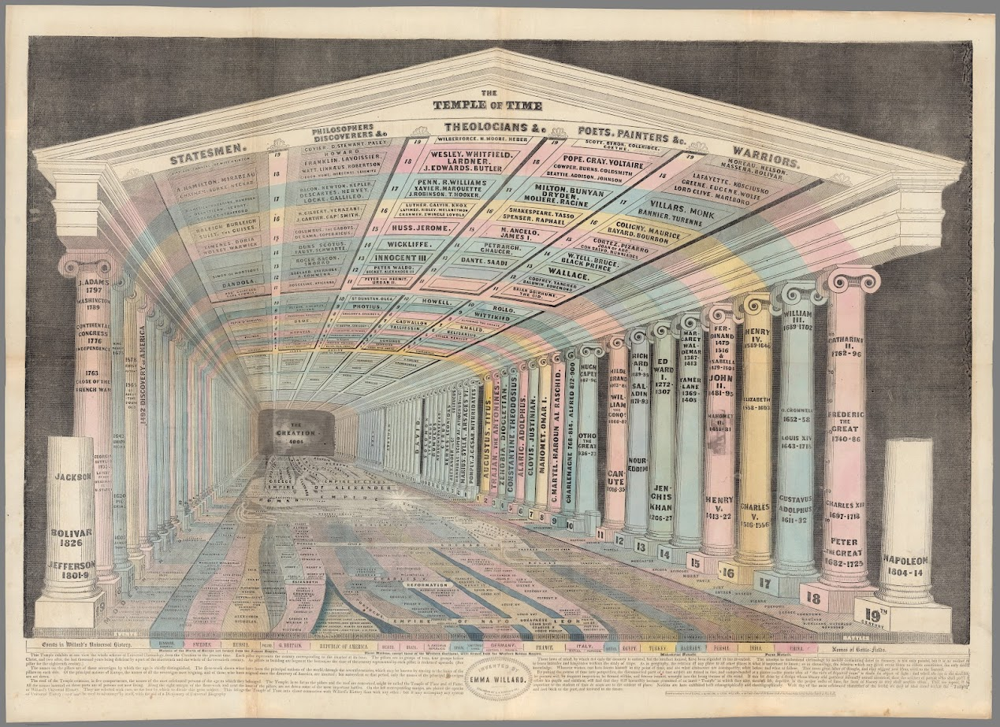

<h1 align="center">
     
</h1>
<h1 align="center"> Cabeza de tuna </h1>

  

  

      <figure></figure>
    

---

## A la deriva *(21-jul)*

---

 

Conrado Eggers Lan y Victoria E. Juliá, eds., *Los filósofos presocráticos II* (1981: Gredos, 1981), p. 34.

---

El hombre pisó algo blanduzco, y enseguida sintió la mordedura en el pie. Saltó adelante, y al volverse con un juramento vio una yararacusú que arrollada sobre sí misma, esperaba otro ataque.

> El hombre pisó algo blanduzco, y enseguida sintió la mordedura en el pie. Saltó adelante, y al volverse con un juramento vio una yararacusú que arrollada sobre sí misma, esperaba otro ataque. 

